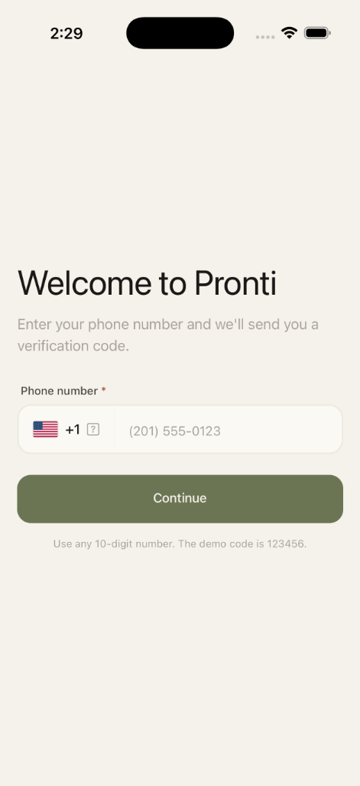
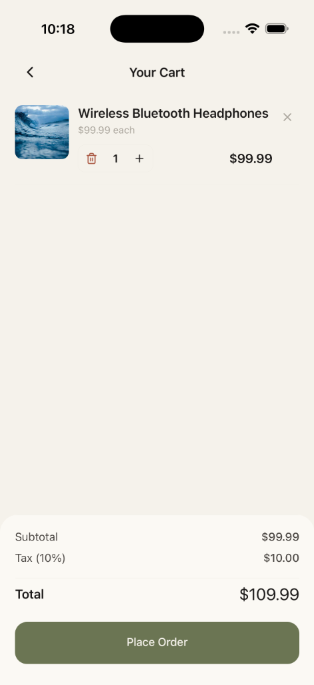
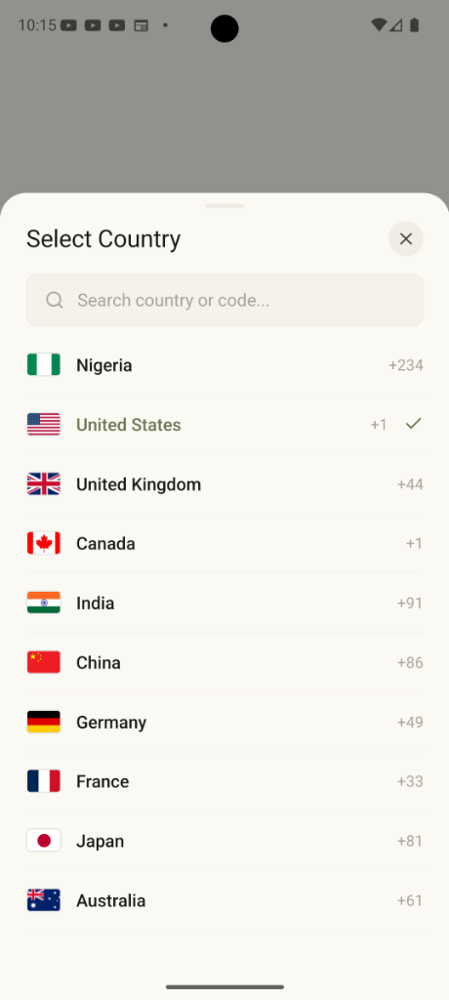

# pronti-ecommerce

A performant e-commerce mobile application built with **React Native CLI**, **Redux Toolkit**, **Redux-Saga**, **Apollo Client**, and **TypeScript**.

---

## 📱 App Screenshots

### iOS

|                 Login Screen                 |                  Products Screen                   |              Cart & Checkout               |
| :------------------------------------------: | :------------------------------------------------: | :----------------------------------------: |
|  |  |  |

### Android

|                              Login Screen                              |                      Products Screen                       |                        Cart & Checkout                         |
| :--------------------------------------------------------------------: | :--------------------------------------------------------: | :------------------------------------------------------------: |
|  |  |  |

---

## 🔑 Mock Credentials & Demo Information

| Parameter                     | Value / Format                                                     | Note                                      |
| :---------------------------- | :----------------------------------------------------------------- | :---------------------------------------- |
| **Estimated Completion Time** | **14 hours**                                                       | Expected total development effort         |
| **Phone Number**              | Any valid 10-digit number (e.g., `1234567890` or `(123) 456-7890`) | Accepts standard 10-digit phone inputs    |
| **Demo OTP Code**             | `123456`                                                           |
| **Invalid OTP**               | Any other 6-digit code                                             | Triggers simulated authentication failure |

---

## 🚀 Setup & Installation Instructions

### Prerequisites

- **Node.js**: `>= 22.11.0`
- **React Native CLI**
- **Android Studio** & Android SDK (for Android builds)
- **Xcode** & CocoaPods (for iOS builds, macOS only)

### 1. Install Dependencies

```bash
npm install
```

### 2. Install iOS CocoaPods (iOS only)

```bash
cd ios
bundle exec pod install
cd ..
```

### 3. Start Metro Bundler

```bash
npm start -- --reset-cache
```

### 4. Run on Device / Emulator

- **Android**:
  ```bash
  npm run android
  ```
- **iOS**:
  ```bash
  npm run ios
  ```

### 5. Running Tests

To run the unit test suites:

```bash
npm test
```

---

## 🛠️ Technical Decisions & Architecture

### 1. State Management & Async Side-Effects

- **Redux Toolkit (`@reduxjs/toolkit`)**: Used for managing localized application state slices (`auth`, `cart`, `order`).
- **Redux-Saga (`redux-saga`)**: Handles complex asynchronous authentication workflows (e.g. OTP validation delays and error handling).

### 2. GraphQL & Apollo Client Integration

- **Apollo Client (`@apollo/client`)**: Configured with local resolvers to simulate realistic GraphQL query fetching and schema execution without requiring external backend servers.

### 3. State Hydration & Boot UX Optimization

- **Cart Persistence**: Utilizes `@react-native-async-storage/async-storage` with an `isHydrated` state check in `cartSlice` to prevent race conditions during app launch.
- **Flash-Free Auth Boot**: Uses an `isRestored` flag in `authSlice` to display a centered loading indicator during startup token verification. This completely eliminates UI flashes of the login screen for logged-in users.

### 4. Path Alias & Type Safety

- **Babel Module Resolver**: Aliased imports via `@/*` pointing to `src/*` for clean and maintainable module imports.
- **Strict TypeScript Setup**: Fully typed navigation stacks (`AuthStackParamList`, `AppStackParamList`) and Redux hooks.

---

## ⚠️ Known Limitations

1. **Mock Backend**: The app uses simulated GraphQL responses and mock delays rather than a live REST/GraphQL backend API.
2. **Mock OTP**: No real SMS provider (e.g., Twilio) is connected; OTP verification uses the static code `123456`.
3. **Simulated Failure Rate**: Order placement simulates a 10% network failure rate for testing error-handling resilience.
